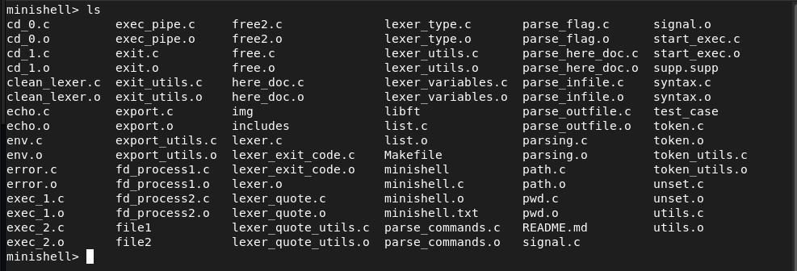
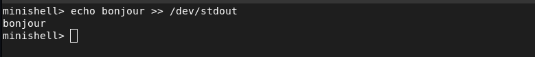
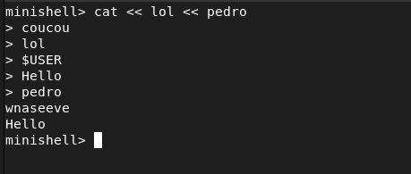
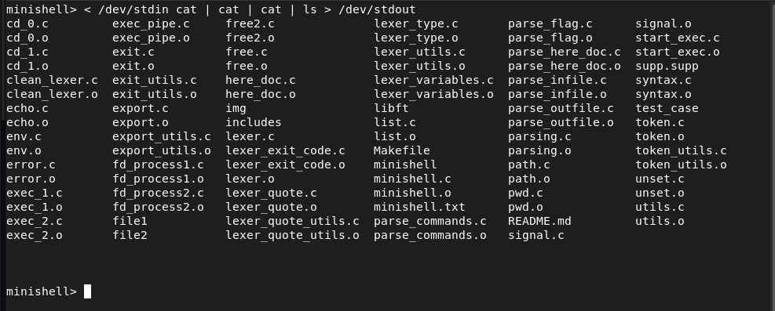
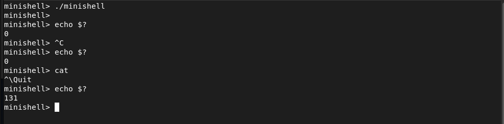
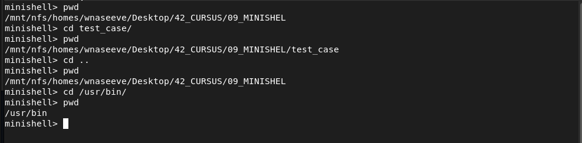
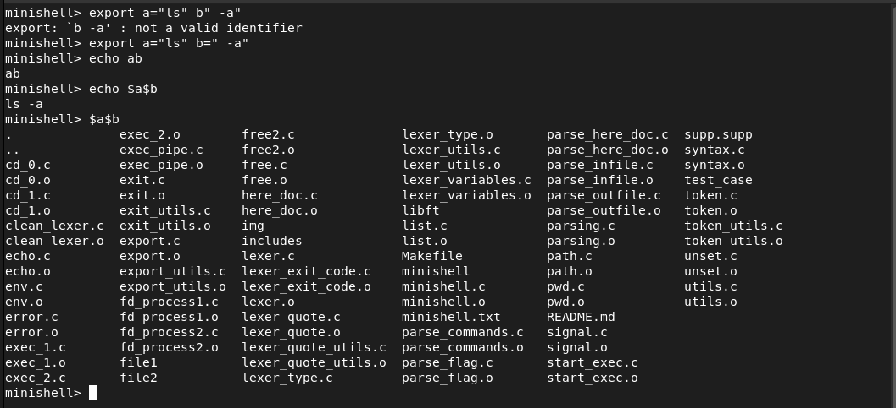
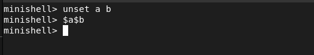
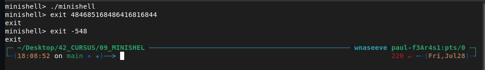

# MINISHELL

Recreate a small Bash-inspired shell for UNIX in C programming language. 

Description:
> The existence of shells is linked to the very existence of IT. The purpose was to write a minishell, a femtoshell we could say.

This is a group project done with [Alexis_Audevar](https://profile.intra.42.fr/users/aaudevar#)

The shell must:

- Display a prompt when waiting for a new command
- Have a working history
- Search and launch the right executable (based on the PATH variable or using a relative or an absolute path)
- Not interpret  unclosed quotes or special characters which are not required by the subject such as \ (backslash) or ; (semicolon)
- Handle single quote and double quote
- Expand environnement variables, including '$?'
- Detect syntax errors
- Execute redirections (<, >, <<, >>)
- Execute pipes
- Execute commands, such as 'cat', 'ls', 'grep', 'awk', 'sed'
- Execute built-ins, such as 'echo', 'cd', 'pwd', 'export', 'unset', 'env' and 'exit'
- Handle signals (ctrl-c, ctrl-d, ctrl-\)
- Send the right exit-code

The program is no memory leaks friendly

## Run the script

```
git clone https://github.com/waseemnaseeven/MINISHELL.git
cd MINISHELL/
make
./minishell
```

## Examples

- Command



- Redirections



- Here_doc



- Pipes & redirections



- Signals



- Some builtins








